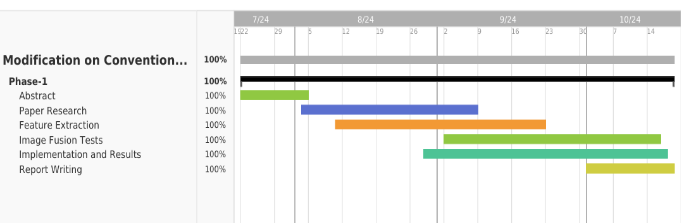
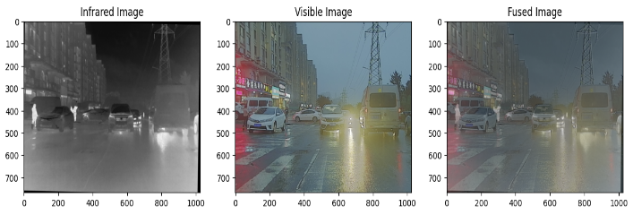
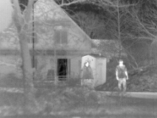
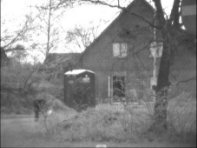
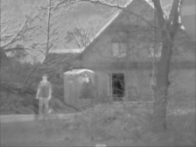
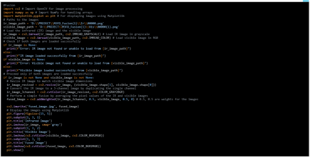
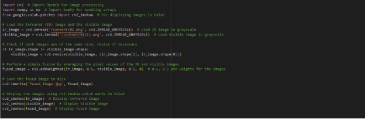

         **Modification on Conventional Visible and**

`             `**Infrared Image fusion methods for Real time Applications**                  

**Modification on Conventional Visible and Infrared Image Fusion Methods for Real-time Applications**

**Submitted By**

**Netla Shanmuka Harshavardhan Reddy                     –BU21EECE0100186**

**Battula Thanuja                                                             –BU21EECE0100295**

**Siddavatam Mohammad Khwaja Moinuddin             –BU21EECE0100381**

**Under the Guidance of** 

**Dr Jeevan K M, Assistant Professor**

**(Duration: 23/07/2024 to 25/10/2024)**

![ref1]

**Department of Electrical, Electronics and Communication Engineering** 

**GITAM School of Technology**

**(GITAM DEEMED TO BE UNIVERSITY)**

**(Estd. u/s 3 of the UGC Act 1956)**

**NH 207, Nagadenehalli, Doddaballapura taluk, Bengaluru-561203 Karnataka, INDIA**

**DECLARATION**

**I/We declare that the work contained in this report is original and has been done by me under the guidance of my project guide.**

`                                                                                                    `**Name:** 

`                                                                                                `**Dr Jeevan K M**
**

**Date:**  

**18-10-2024                                                                    Signature of the Student**

`                                                                                       `**N. Shanmuka Harsha**

`                                                                                       `**B. Thanuja**

`                                                                                       `**S. MD. Khwaja Moinuddin**
**

**Department of Electrical, Electronics and Communication Engineering**

**GITAM School of Technology, Bengaluru-561203**

`                                              `**![ref1]**

**                            

**CERTIFICATE**

This is to certify that **(Netla Shanmuka Harshavardhan Reddy BU21EECE0100186), (Battula Thanuja –BU21EECE0100295), and (Siddavatam Mohammad Khwaja Moinuddin – BU21EECE0100381)** has satisfactorily completed Mini Project Entitled in partial fulfilment of the requirements as prescribed by University for **VIIth semester**, Bachelor of Technology in “Electrical, Electronics and Communication Engineering” and submitted this report during the academic year 2024-2025.

**Signature of the Guide                                           Signature of HOD**

**Dr. Jeevan. K.M                                                      Dr. Prithvi Sekhar Pagala**

**Table of contents**

[**Chapter 1: Introduction	1**](#_heading=h.gjdgxs)**

[1.1 Overview of the Problem Statement	1](#_heading=h.30j0zll)

[1.2 Objectives and Goals	1](#_heading=h.1fob9te)

[**Chapter 2: Literature Review	2**](#_heading=h.3znysh7)

[**Chapter 3: Strategic Analysis and Problem Definition	3**](#_heading=h.2et92p0)

[3.1 SWOT Analysis	3](#_heading=h.tyjcwt)

[3.2 Project Plan - GANTT Chart	3](#_heading=h.1t3h5sf)

[3.](#_heading=h.2s8eyo1)[3](#_heading=h.2s8eyo1)[ Refinement of Problem Statement	3](#_heading=h.2s8eyo1)

[**Chapter 4: Methodology	4**](#_heading=h.17dp8vu)

[4.1 Description of the approach	4](#_heading=h.3rdcrjn)

[4.2 Tools and Techniques Utilized	4](#_heading=h.26in1rg)

[4.3 Design Considerations	4](#_heading=h.lnxbz9)

[**Chapter 5: Implementation	5**](#_heading=h.1ksv4uv)

[5.1 Description of how the project was executed	5](#_heading=h.44sinio)

[5.2 Challenges faced and solutions implemented	5](#_heading=h.2jxsxqh)

[**Chapter  6:Results	6**](#_heading=h.z337ya)

[6.1 outcomes	6](#_heading=h.3j2qqm3)

[6.2 Interpretation of Results	6](#_heading=h.1y810tw)

[6.3 Comparison with existing literature or technologies	6](#_heading=h.2xcytpi)

[**Chapter 7: Conclusion	7**](#_heading=h.1ci93xb)

[**Chapter 8: Future Work	8**](#_heading=h.2bn6wsx)

[Here write Suggestions for further research or development Potential improvements or extensions	8](#_heading=h.qsh70q)

[**References	9**](#_heading=h.1pxezwc)

#
# **Chapter 1: Introduction**
## 1.1 Overview of the problem statement
## The project addresses the challenge of enhancing “visible and infrared image fusion” for real-time applications, where combining data from both imaging modalities is essential. Infrared images capture thermal radiation, providing crucial information in low-light or night vision scenarios and temperature detection, while visible images offer rich details in colour, texture, and shape. The fusion of these images significantly improves decision-making by providing a comprehensive view of a scene, especially in fields like “surveillance, medical imaging, and remote sensing”.
## Many existing deep learning (DL) methods for image fusion require prior knowledge and struggle to generalize across diverse environmental and lighting conditions. This makes them less effective for real-time applications, especially when hardware resources are limited. Although conventional fusion methods are simpler and more compatible with existing hardware, they often lack the efficiency and image quality required for real-time processing.
## This project aims to modify and enhance conventional fusion methods to improve the quality of fused images and make them more suitable for real-time applications. The focus is on maintaining simplicity and efficiency while ensuring compatibility with existing hardware, and addressing the limitations of current deep-learning approaches. 
## 1\.2 Objectives and Goals
- ## Objectives:
##
##
## To develop and optimize algorithms that improve the fusion of visible and infrared images, ensuring the preservation of critical information from both modalities in real-time applications.
## To enhance the computational efficiency of conventional image fusion methods, enabling their deployment on resource-constrained devices without compromising performance.

To integrate the modified image fusion techniques seamlessly with existing real-time systems, facilitating their adoption in applications like surveillance, medical imaging, and remote sensing.
- ## Goals:
- ## **Main Goals** 
Multi-Resolution Details
Remote Sensing
Enhanced Visualization and Analysis
- ## **Additional Goals:**
Real-time Processing
Accurate
# **Chapter 2: Literature Review**
- ## Key Publications 

|S.NO|Title|` `Author|Published In|Abstract|
| :- | :- | :- | :- | :- |
|1|A Colour-Focused Visible and Infrared Image Fusion Framework for Aiding Human Perception|Nithin Eswarappa, Shefali Waldekar, Jeevan K.M, Bikram Kumar Vivek and Koshy George|
2024 IEEE International Conference on Electronics, Computing and Communication Technologies (CONNECT),

Date of Conference: 12-14 July 2024,

Date Added to IEEE Xplore: 20 September 2024
|
Image fusion methods are required when images from the same or different sensors are available. In several applications, photographs from a colour camera are often fused with thermal infrared (medium-wave or long-wave) images. This paper focuses on those applications (typically security and 

surveillance) where the fused images are used by a human operator who will, in turn, make critical decisions. This paper presents two frameworks for fusing colour and infrared images, one in the red-green-blue (RGB) colour space and the other in the lightness-chroma-hue (LCH) colour space. We compare qualitatively and quantitatively the performance of five existing fusion methods that work best in this scenario. The study is carried out across two datasets. Quantitatively, four existing metrics are used to analyse the performance. In addition, this paper proposes a performance metric that appeals to human perception and measures how well colour, edge, and contrast information are transferred to the fused image.
|
|2|Infrared and visible image fusion based on domain transform filtering and sparse representation.|Xilai Li, Haishu Tan, Fuqiang Zhou, Gao Wang,Xiaosong Li|June 2023, Infrared Physics & Technology, Volume 131, 104701|This paper presents a new method for combining infrared and visible images to provide clearer and more detailed images of complex scenes. The process involves breaking the images into simpler base layers and detailed layers. The detailed layers are merged using a technique that enhances important features. A special filter (DTF) is used to combine the base layers while keeping key structures and edges intact. This approach helps retain important details from both images. Tests show that the method produces better results than other existing methods, both visually and in terms of measurable quality.|

- ## Key Resources

|S.NO|Title|` `Author|Published In|Abstract|
| :- | :- | :- | :- | :- |
|1|Image Fusion technique using Multi-resolution singular Value decomposition|V.P.S. Naidu|5, September 2011, defence Science Journal, Vol. 61, pp. 479-484|A novel image fusion technique based on multi-resolution singular value decomposition (MSVD) has been presented and evaluated. The performance of this algorithm is compared with that of a well-known image fusion technique using wavelets. It is observed that image fusion by MSVD performs almost similarly to that of wavelets. It is computationally very simple, and it could be well suited for real-time applications. Moreover, MSVD does not have a fixed set of basis vectors like FFT, DCT, wavelet, etc., and its basis vectors depend on the data set. |
# **Chapter 3: Strategic Analysis and Problem Definition**
## 3.1 SWOT Analysis

- Strengths 
- ## Valuable Information from Infrared Imaging
- ## Enhanced Decision-Making
- ## Efficiency of Conventional Methods

- Weaknesses
- ## Dependency on Conventional Methods
- ## Hardware Constraints
- ## Generalization Challenges

- Opportunities
- ## Adaptation to Emerging Technologies
- ## Market for Resource-Constrained Environments
- ## Government and Defense Contracts
- ## Healthcare and Medical Imaging

- Threats
- ## Competition from Advanced Techniques
- ## Security and Privacy Concerns
## 3.2 Project Plan - GANTT Chart 

## 3.3 Refinement of problem statement
- ## To enhance conventional visible and infrared image fusion methods by implementing innovative modifications that improve the quality, efficiency, and real-time applicability of fused images. The project aims to develop algorithms that effectively combine visible and infrared data, optimizing them for use in resource-constrained environments and across diverse real-world applications such as surveillance, medical imaging, and remote sensing.

#
# **Chapter 4: Methodology**
## 4.1 Description of the approach
## In this Project, we detail the methodology adopted for modifying conventional visible and infrared image fusion methods to meet the requirements of real-time applications. Our approach centres around enhancing existing fusion algorithms to improve performance, robustness, and efficiency in various practical scenarios.
## **Multi-Resolution Analysis:** Employing wavelet transforms, we decompose images into different resolution levels, allowing for effective fusion of fine and coarse details. This hierarchical approach ensures that important features are preserved and highlighted in the final fused image.
## **Real-Time Optimization:** We prioritize computational efficiency by optimizing algorithms for speed and low latency, making them suitable for real-time processing. This includes parallel processing and hardware acceleration techniques.
## 4.2 Tools and techniques utilized
**Software Tools:** We utilize programming environments such as Python with libraries like OpenCV and NumPy for image processing and fusion tasks.

**Hardware Platforms:** Our implementations are tested on resource-constrained devices, including Raspberry Pi and NVIDIA Jetson, to ensure the algorithms are efficient and scalable.

**Fusion Algorithms:** Wavelet Transform: Used for multi-resolution decomposition, enabling the fusion of images at different levels of detail.

**Laplacian Pyramid:** Another multi-resolution technique that helps in blending images smoothly and preserving edges.
## 4.3 Design considerations
**Scalability:** We consider the scalability of our approach to handle high-resolution images and large datasets efficiently. This involves optimizing memory usage and processing power.

**Real-Time Processing:** To meet real-time application requirements, we design our fusion algorithms with low latency and high throughput in mind. This includes leveraging the parallel processing capabilities of modern CPUs and GPUs.

**Chapter 5: Implementation**

5.1 Description of how the project was executed
## **Requirements Analysis and Planning:**
- ## We began by clearly defining the objectives of the project, focusing on enhancing existing image fusion techniques to work efficiently in real-time and resource-constrained settings.
- ## A thorough review of current image fusion methods, particularly those used in visible and infrared imaging, was conducted to identify strengths, weaknesses, and potential areas for improvement.
## **Algorithm Development and Adaptation:** 
- ## Based on the literature review, we selected promising conventional image fusion algorithms such as wavelet transforms, and Laplacian pyramids.
- The selected algorithms were adapted to enhance their computational efficiency. 

- ## This involved optimizing the code for parallel processing and reducing the computational complexity where possible.
- ## The fused images were evaluated using metrics like Structural Similarity Index (SSIM), Peak Signal-to-Noise Ratio (PSNR), and visual inspection to assess the quality and effectiveness of the fusion.
### 5.2 Challenges faced and solutions implemented
The project faced several significant challenges, from ensuring computational efficiency and real-time processing to maintaining robustness and adapting to new technologies. Through a combination of algorithm optimization, adaptive techniques, and efficient data handling, these challenges were effectively addressed. The solutions implemented not only enhanced the performance and reliability of the image fusion methods but also ensured their applicability across a wide range of real-time applications and resource-constrained environments.

**Chapter 6: Results**

6.1 outcomes 

    
### 6.2 Interpretation of results

####
## 6.3 Comparison with existing literature or technologies

` `**Computational Efficiency**:

- **Existing Methods**: Many conventional methods, such as PCA and wavelet transform, are computationally intensive, making them less suitable for real-time applications on resource-constrained devices.
- **Our Approach**: We optimized the computational efficiency by utilizing parallel processing and hardware acceleration, ensuring that our fusion methods can operate in real-time on devices with limited resources.

**Real-Time Processing**:

- **Existing Methods**: Methods like IHS and edge detection-based fusion often suffer from high latency, which is problematic for real-time applications.
- **Our Approach**: We designed low-latency algorithms with efficient data handling and streamlined processing steps, achieving real-time performance without compromising image quality.

# **Chapter 7: Conclusion**

The project successfully explores modifications to conventional image fusion methods for visible and infrared images, focusing on real-time applications. By combining the strengths of both imaging modalities, the project enhances decision-making and information processing in areas like surveillance, medical imaging, and remote sensing. The modified methods address the limitations of deep learning approaches, such as requiring prior knowledge and difficulties with generalization, making them more suitable for existing hardware and real-time scenarios. The proposed solutions improve the quality and efficiency of fused images, providing better visualization and analysis without compromising speed, which is critical in resource-constrained environments.
#
# **Chapter 8: Future Work**
#### In future work, the implementation of the modified image fusion methods on the NVIDIA Jetson Nano platform will be explored to leverage its computational capabilities for real-time applications. Detailed measurements of computational time will be conducted to assess the performance of the fusion algorithms. Strategies to optimize and improve the computational efficiency will be investigated to ensure the methods meet real-time processing requirements. This includes fine-tuning algorithm parameters and possibly incorporating hardware acceleration techniques to further enhance processing speed and overall system performance.
# **References** 
## [A Colour-Focused Visible and Infrared Image Fusion Framework for Aiding Human Perception](https://ieeexplore.ieee.org/abstract/document/10677151/) [[N Eswarappa](https://scholar.google.com/citations?user=QV5agwIAAAAJ&hl=en&oi=sra), [S Waldekar](https://scholar.google.com/citations?user=DE0xFUIAAAAJ&hl=en&oi=sra), KM Jeevan, BK Vivek, K George] [12-14 July 2024], 2024 IEEE International Conference on Electronics, Computing
## Infrared and visible image fusion based on domain transform filtering and sparse representation, Xilai Li, Haishu Tan, Fuqiang Zhou, Gao Wang,Xiaosong Li, June 2023, Infrared Physics & Technology, Volume 131, 104701
## [MS-SVD] Image Fusion technique using Multi-resolution singular Value decomposition, VPS Naideu, 2011
## [LP] The Laplacian Pyramid as a Compact Image Code, Burt, 1983
## [MST-LP] Infrared and visible image fusion based on target-enhanced multiscale transform decomposition, 2019
1

[ref1]: Aspose.Words.b5b7c685-55db-43fb-a953-be479ef1cdd1.003.png
